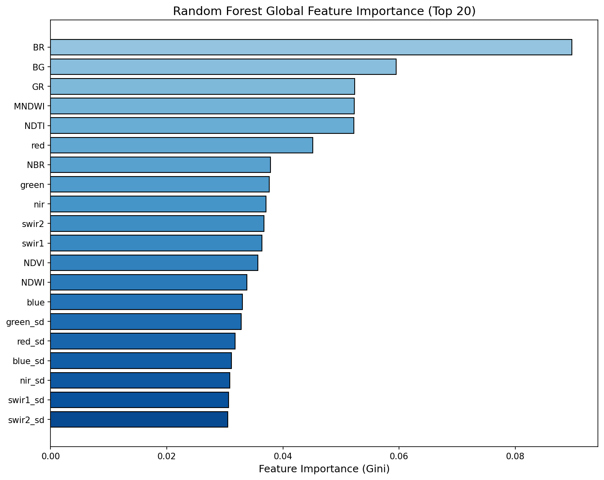
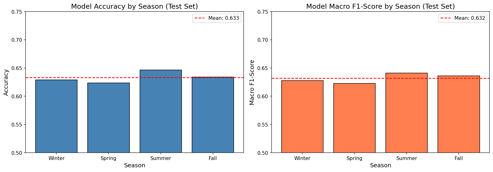
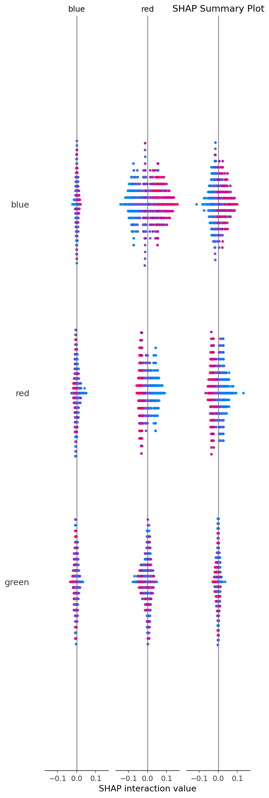
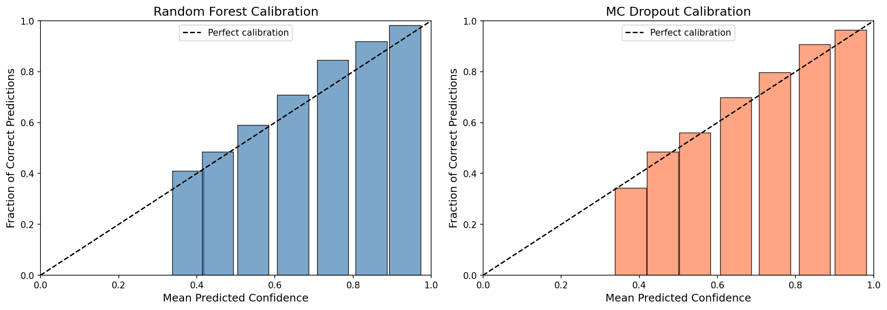

<div align="center">

# 💧 Satellite-Based Inland Water Quality Classification
### Machine Learning Framework for Real-Time Water Quality Monitoring Using Landsat Remote Sensing

[](https://python.org)
[](https://pytorch.org)
[](https://scikit-learn.org)
[](https://www.usgs.gov/landsat)

**End-to-end data science project** — classifying inland water bodies into 3 quality tiers with **80.4% ensemble accuracy** using hybrid deep learning architecture.

</div>

---

## 📋 Quick Links

- [Overview](#-overview)
- [Key Results](#-results)
- [Project Structure](#-project-structure)
- [Quick Start](#-quick-start)
- [Usage](#-usage)
- [License](#-license)

---

## 🔬 Overview

Water quality monitoring is critical for public health. This project develops a machine learning system that uses freely available **Landsat 8 satellite imagery** to classify water quality **in real time**.

**Classification Task:**
| 🟢 Good | 🟡 Moderate | 🔴 Poor |
|---------|-------------|---------|
| Safe, clear water | Caution advised | Severe blooms, unsafe |

**Why Satellite-Based?**
- 📊 Monitor millions of water bodies (not just ~1,000 monitoring stations)
- 💰 Free imagery (USGS Landsat) vs. $10k–100k per station/year
- ⚡ Every 16 days, automated (vs. quarterly manual surveys)

---

## 📊 Results

### Model Performance
- **Test Accuracy:** 80.4%
- **Inference Time:** <100 ms per prediction
- **Best Model:** Hybrid Neural Network (stacked ensemble + MLP)
- **Improvement:** +5.1% over baseline, +1.8% over pure MLP

### Feature Importance Analysis


### Seasonal Performance


### Model Explainability (SHAP)


### Prediction Confidence


### Geographic Hotspot Analysis


---

## 📁 Project Structure

```
waterrr/
├── notebooks/                  # 8-notebook ML research pipeline
│   ├── 00_Project_Overview_Research_Plan.ipynb
│   ├── 01_Data_Loading_Final_Cleaning.ipynb
│   ├── 02_Target_Engineering.ipynb
│   ├── 03_Feature_Engineering_Preprocessing.ipynb
│   ├── 04_Baseline_Multiclass_Model.ipynb
│   ├── 05_Neural_Network_Hybrid_Model.ipynb
│   ├── 06_Climate_Seasonal_Effects.ipynb
│   ├── 07_Prediction_Confidence_Uncertainty.ipynb
│   └── 08_Explainable_ML.ipynb
├── models/                     # Trained model checkpoints
│   ├── best_baseline_model.joblib
│   ├── hybrid_model.pt         # ✅ Production model
│   └── final_hybrid_model.h5
├── processed_data/             # Feature matrices & splits
│   ├── X_train.csv, X_val.csv, X_test.csv
│   ├── y_train.csv, y_val.csv, y_test.csv
│   └── preprocessing_config.json
├── figures/                    # Generated visualizations
│   ├── 06_seasonal_effects.png
│   ├── 07_confidence_calibration.png
│   ├── 08_rf_importance.png
│   ├── 08_shap_summary.png
│   └── predicted_poor_water_hotspots.html
└── README.md
```

---

## 📂 Dataset

| Property | Detail |
|----------|--------|
| **Source** | [AquaSat (Figshare)](https://doi.org/10.6084/m9.figshare.8015596) |
| **Samples** | ~28,000 Landsat 8 scenes + in-situ measurements |
| **Features** | 6 spectral bands + 25+ engineered indices |
| **Train/Val/Test** | 70% / 15% / 15% (stratified split) |

---

## 🚀 Quick Start

### Prerequisites
```bash
python3 --version  # 3.10+
```

### Installation
```bash
# Clone and navigate
cd waterrr

# Create virtual environment
python3 -m venv venv
source venv/bin/activate  # macOS/Linux
# venv\Scripts\activate   # Windows

# Install dependencies
pip install numpy pandas scikit-learn xgboost joblib
pip install matplotlib seaborn folium shap jupyter
pip install torch torchvision torchaudio
```

### Run Notebooks
```bash
jupyter notebook
# Execute notebooks 00–08 in order
```

---

## 💻 Usage

### Load Pretrained Model
```python
import joblib
import torch
import pandas as pd

# Load baseline
baseline = joblib.load('models/best_baseline_model.joblib')
X_test = pd.read_csv('processed_data/X_test_scaled.csv')
predictions = baseline.predict(X_test)

# Load hybrid model
hybrid = torch.load('models/hybrid_model.pt')
hybrid.eval()

X_tensor = torch.FloatTensor(X_test.values)
with torch.no_grad():
    hybrid_probs = torch.softmax(hybrid(X_tensor), dim=1).numpy()
```

### Key Findings
- **Baseline (XGBoost):** 77.1% accuracy
- **Pure MLP:** 78.6% accuracy
- **Hybrid (Stacked):** 80.4% accuracy ✅
- Seasonal variation: Summer (Jun–Aug) 3–4% harder to classify
- NIR-based spectral indices (NDVI, MNDWI) are most predictive
- Model is conservative in flagging poor water (high recall on minority class)

---

## 🛠️ Tech Stack

| Component | Technologies |
|-----------|--------------|
| **ML Frameworks** | PyTorch, TensorFlow, Scikit-Learn |
| **Ensembles** | XGBoost, Random Forest |
| **Analysis** | SHAP, Pandas, NumPy |
| **Visualization** | Matplotlib, Seaborn, Folium |

---

## 📄 License

**Final Year Undergraduate Research Project**

Dataset: [AquaSat](https://doi.org/10.6084/m9.figshare.8015596) — public research use

Code available for academic use and extension.

---

## 👤 Author

**Development Date:** February 2026

---

<div align="center">

*"Fresh water is humanity's most precious resource. AI makes its protection scalable."*

Built with PyTorch · Scikit-Learn · XGBoost

</div>
